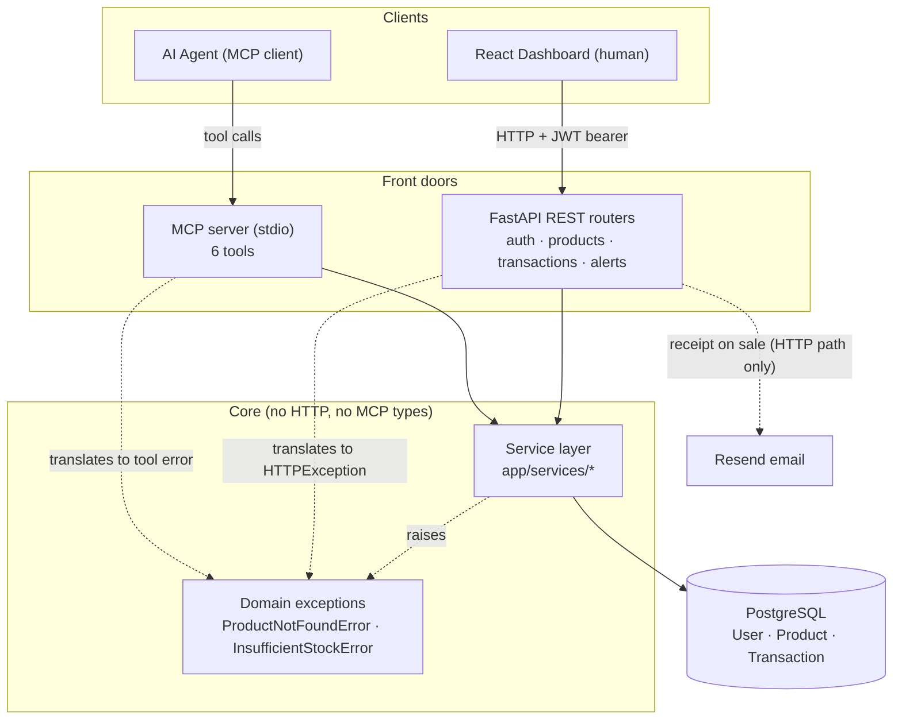

# Logical Structure Document — Inventra

## System overview

Inventra is a layered application with a single core of business logic exposed through
**two independent front doors**:

- a **REST API** (FastAPI) consumed by a human-facing React dashboard, and
- an **MCP server** (stdio transport) consumed by an AI agent.

Both front doors call the **same service layer**, which is the only place that touches
the database and the only place business rules (the oversell guard, stock math,
analytics aggregation) live. This guarantees that human-initiated and agent-initiated
operations behave identically — the rules cannot drift between the two paths.

## Architecture

## Layers

**1. Data layer** — SQLAlchemy ORM models and a PostgreSQL database. A `get_db`
generator yields a request-scoped session for the REST path; the MCP path opens and
closes its own session per tool call.

**2. Service layer** (`app/services/`) — plain Python functions taking
`(db: Session, owner_id: int, ...params)`. No FastAPI types, no `Depends(...)`, no
`HTTPException`. Business errors are raised as **domain exceptions**
(`ProductNotFoundError`, `InsufficientStockError`, the latter carrying `available` and
`requested`). This is the shared core both front doors depend on.

**3a. REST API layer** (`app/routers/`) — FastAPI routers that resolve an authenticated
`User` from a JWT bearer token, call the service functions, and translate domain
exceptions back into HTTP responses (`ProductNotFoundError` → 404,
`InsufficientStockError` → 400). The transaction router additionally sends a Resend
email receipt **after** the service call — this side effect lives only on the HTTP path.

**3b. MCP layer** (`app/mcp_server.py`) — a stdio MCP server exposing six tools. At
startup it resolves a single owner from the `INVENTRA_OWNER_EMAIL` environment variable
and caches that user's `owner_id` (an integer, never the ORM object). Each tool opens
its own session, calls the matching service function, **serializes results to plain
dicts while the session is still open**, then closes the session. It sends no email.

**4. Frontend** — a single-page React dashboard (product list, low-stock view, a
record-transaction form, and a revenue/profit chart) that consumes the REST API over
HTTP with a JWT bearer token.

## Data model

| Entity | Fields | Relationships |
|---|---|---|
| **User** | `id` (PK), `email` (unique), `full_name`, `hashed_password`, `created_at` | owns many Products |
| **Product** | `id` (PK), `name`, `sku` (unique), `quantity` (int), `price` (decimal), `cost_price` (decimal), `low_stock_threshold` (int, default 10), `expiry_date` (date, nullable), `owner_id` (FK → User) | belongs to one User; has many Transactions |
| **Transaction** | `id` (PK), `product_id` (FK → Product), `type` (enum: `sale` \| `restock`), `quantity` (int), `note` (nullable), `created_at` | belongs to one Product |

All product-scoped queries filter by `owner_id` so a user (or the single MCP owner)
only ever sees and mutates their own inventory.

## Data flow: the two paths converge

**Human records a sale (HTTP):**
1. Dashboard sends `POST /transactions` with a JWT bearer token.
2. Router resolves the `User` from the token, calls
   `record_transaction(db, owner_id, product_id, "sale", quantity, note)`.
3. Service checks `quantity` against on-hand stock; if insufficient, raises
   `InsufficientStockError(available, requested)`. Otherwise it deducts stock and
   persists the Transaction.
4. Router translates a raised error to HTTP 400, or on success sends an email receipt
   and returns the transaction.

**Agent records a sale (MCP):**
1. Agent calls the `record_transaction` tool with `product_id`, `type`, `quantity`.
2. MCP server opens a session, calls the **same**
   `record_transaction(db, cached_owner_id, ...)` service function.
3. Same guard, same stock math, same persistence.
4. On `InsufficientStockError`, the tool returns a structured error
   (`{success: false, error: "insufficient_stock", available, requested, ...}`) the
   agent can reason about; on success it returns the new transaction and updated
   quantity. No email is sent.

The only differences between paths are at the edges (auth source, error translation,
the email side effect) — never in the business logic itself.

## Cross-cutting invariants

- **Oversell guard** is enforced in the service layer, so it holds identically for both
  front doors.
- **Single source of truth:** all business rules live in `app/services/`; routers and
  MCP tools are thin translation layers.
- **Tenant isolation:** every query is scoped by `owner_id`.
- **MCP session safety:** one session per tool call; results serialized to dicts before
  the session closes (prevents `DetachedInstanceError`).
- **Email isolation:** receipts are sent only on the REST path, never from MCP tools.